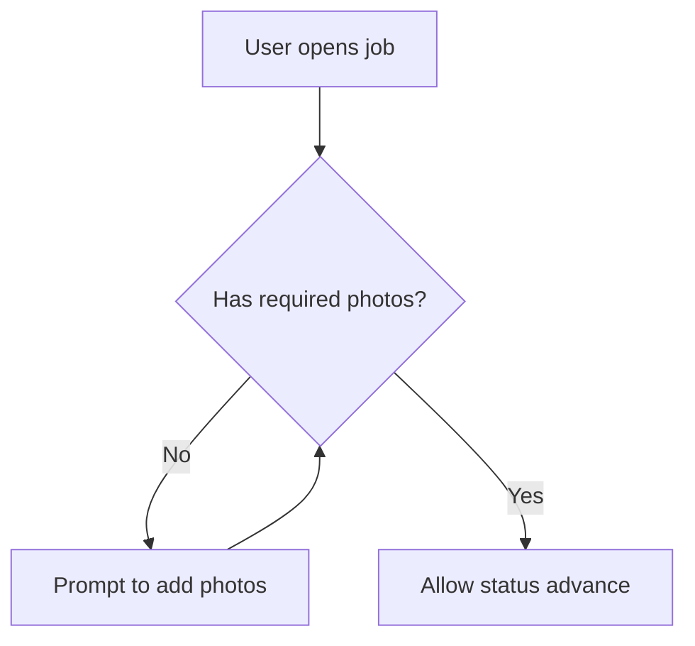

# Storyline

## What specs are for

Specs are **durable intent**: who the feature is for, **why** it exists, **what** users should experience, and **acceptance** in plain language. They are **not** a substitute for code—avoid class names, long endpoint lists, and implementation walkthroughs unless a short **technical requirement** matters (e.g. “must call registry X”, “no PII in logs”).

You may take light structural inspiration from foldered spec examples (e.g. [spec-kit-style demos](https://github.com/mnriem/spec-kit-dotnet-cli-demo/tree/main/specs/001-timezone-utility)), but **stay much shorter**—Storyline is intentionally lean. Use **one `SPEC.md`** until churn or length justify splitting (see **Feature folder shape**).

## Always do this alongside implementation

Whenever you **write or materially change** application code (features, bugfixes, refactors, migrations, config that affects behavior), also **update or create** the relevant spec under `specs/` **and touch `specs/OVERVIEW.md` when the big picture shifts** (see below).

If the user **only** explores or asks questions without changing behavior, you may **read** specs and code without writing files unless they ask you to document something.

## Layout

- **`specs/OVERVIEW.md`** — product- and system-level **orientation** (what the service offers, main capabilities in user terms, who it’s for). Keep **Tech stack**, **External systems**, and **Code map** short; they exist so developers can orient quickly, not to duplicate feature specs.
- **Feature specs** — each feature lives in a folder that contains **`SPEC.md`** as the entry (see **Feature folder shape** and **Scaling** below). Path is either **flat** (`specs/<feature-slug>/`) or **grouped** (`specs/<area>/<feature-slug>/`).
- **Optional extras** (any layout):
  - **`specs/ARCHITECTURE.md`** — **only if** the codebase uses **non-obvious structural patterns** (see **Architecture patterns** below). Omit entirely when the stack is conventional.
  - **`ui.md`** (per feature) — hints for **UI / app developers** consuming this backend (see **UI hints** below). Especially useful when this repo is API-only.
  - `checklists.md` — release / QA bullets.
  - `contracts/` or `contracts.md` — minimal API or event snippets if stakeholders need a stable reference (avoid duplicating OpenAPI if generated elsewhere).

Do not put specs only in chat; they belong in `specs/`.

### Architecture patterns (`specs/ARCHITECTURE.md`) — optional

Create **`specs/ARCHITECTURE.md`** only when **defaults would mislead** a new developer or agent (e.g. not classic controller → service → repository everywhere, CQRS-style API split, in-memory domain stores, event-driven core, ports & adapters, etc.).

**Include (short):**

- **Baseline in one sentence** — e.g. “Most domains use Spring MVC + `@Service` + JPA repositories unless noted below.”
- **Exceptions only** — bullet per deviation: **what** differs, **where** in the tree (package or module), **why** (one line), link to the feature **`SPEC.md`** path (flat or nested) if detail lives there.
- **Changelog** at bottom — dated lines when a global pattern changes.

**Do not include:** tutorials on Spring Boot, generic layering diagrams, or anything true for “every” service in the repo. If everything is standard, **do not create this file**.

When the file exists, add a single link under **For developers** in **`OVERVIEW.md`** (e.g. “Non-standard patterns: [ARCHITECTURE.md](ARCHITECTURE.md)”). Update **`ARCHITECTURE.md`** in the same session when you introduce or remove a **cross-cutting** structural deviation—not for every small refactor.

### Scaling: area folders and indexes

As the number of features grows, keep **navigation** cheap for humans and agents.

**When to introduce `specs/<area>/` groupings**

- Many feature folders at **`specs/`** root (rough guide: **~8+** or whenever finding a spec feels noisy).
- Clear **bounded contexts** that match how you think or how packages are organized (e.g. `workshop`, `vehicle`, `integration`).

**Nested layout**

```text
specs/
  OVERVIEW.md
  INDEX.md              # optional — master table of all features
  ARCHITECTURE.md         # optional
  README.md               # how specs work in this repo
  workshop/
    README.md             # optional — index of workshop-* specs only
    jobs/
      SPEC.md
      intent.md
      …
  vehicle/
    timeline/
      SPEC.md
```

- Each **feature** is still a folder with **`SPEC.md`** + optional split files; only the **path** gains an **`/<area>/`** segment.
- **`<area>`** = short, stable slug (match domain package or team language).

**Indexes (pick what you need)**

| File | Role |
|------|------|
| **`specs/INDEX.md`** | **Master directory**: table of **Area** (if nested), **Feature**, **Link to `SPEC.md`**, **One-line summary**. Update when adding/renaming/removing a feature folder. Agents use this for **discovery** when the tree is large. |
| **`specs/<area>/README.md`** | **Area hub**: list of features in that area + links; optional one paragraph on how the area fits the product. |

**`OVERVIEW.md` vs indexes**

- **`OVERVIEW.md` → Main capabilities** stays **short** (product-facing bullets with links to **primary** feature entries).
- **`INDEX.md`** holds the **complete** spec catalog; link it from **`specs/README.md`** and optionally from **`OVERVIEW.md`** (“[Full spec index](INDEX.md)” under For developers).

**Migration**

- Moving `specs/foo/` → `specs/area/foo/`: update **all inbound links** (`OVERVIEW.md`, `INDEX.md`, `ARCHITECTURE.md`, other specs), then **git mv** (preserve history). Append **Changelog** lines on affected **`SPEC.md`** files if paths matter to readers.

**Rules**

- Every feature still has **exactly one canonical entry file**: `SPEC.md` (Changelog lives there).
- **Relative links** between files stay within the same feature folder when possible; link across features using paths from `specs/` root (e.g. `../vehicle/timeline/SPEC.md` from a sibling area—prefer root-anchored paths like `vehicle/timeline/SPEC.md` in INDEX).

### Feature folder shape

**Default:** a single **`SPEC.md`** with the full template (below). Good for small or young features.

**Split when** the spec is long or **flows/acceptance change often** while **why/scope** stays stable—so reviewers are not repeatedly re-reading unchanged intent.

| File | Typical contents | Update frequency |
|------|------------------|------------------|
| **`SPEC.md`** | **Entry point**: title, one-line summary, links to other files if split, **Changelog** (always append here when anything in the folder changes). If not split, holds the full template. | Every meaningful spec change (at least Changelog). |
| **`intent.md`** | **Why**, **Who & context**, **Scope** (in/out), **Open questions** (product/policy). | Rarely—when goals, audience, or boundaries shift. |
| **`experience.md`** | **User flows**, **Flow diagram(s)** (Mermaid), **Stories & examples**, **Acceptance / outcomes**. | Often—when user-visible behavior or UX changes. |
| **`constraints.md`** | **Technical requirements** (short), **Pointers to code** (optional). | Sometimes—when NFRs, integrations, or compliance rules change. |
| **`ui.md`** | **Consumer-oriented** notes for frontend/mobile: screens, navigation, which calls to make when, empty/error/loading expectations, auth/context gotchas. **Not** a full OpenAPI dump. | When API shapes, status codes, or user-visible error behavior relevant to clients change. |

Rules:

- **`SPEC.md` is always the canonical entry** (and holds **Changelog**). Links in **`OVERVIEW.md`** and **`INDEX.md`** should point to that file—**flat** `specs/<slug>/SPEC.md` or **nested** `specs/<area>/<slug>/SPEC.md`.
- Split only when it **reduces noise** or **edit churn**—not to mimic heavyweight toolchains.
- Mermaid diagrams live in **`experience.md`** when split; otherwise in **`SPEC.md`** after **User flows**.

### UI hints (`ui.md`) — backend / API repos

Use **`ui.md`** when this project ships **HTTP APIs** and another codebase owns the UI. It bridges product intent and integration—**for app developers**, not for duplicating backend internals.

**Include (concise):**

- **Context** — auth scheme, required headers or roles, path params that double as UX context (e.g. “`workshopId` = location the user is acting in”).
- **Screens or flows** — what to build or wire (list, detail, primary actions) mapped loosely to API **verbs**, not field-by-field DTOs unless critical.
- **Dynamic UI** — e.g. “build inspection form from JSON Schema returned by …”.
- **After mutations** — refetch detail vs optimistic patterns if product cares.
- **Errors & empty states** — what the user should see for 403/404/409/validation (plain language); link OpenAPI/Swagger if the team maintains it.

**Omit:** long payload examples (prefer OpenAPI or `contracts.md`), backend class names, internal store details.

## New work vs continuing work

**Before changing code**, decide which spec folder applies:

1. **Continuing** — same feature area, same conversation thread, or an existing feature folder (flat or `specs/<area>/<slug>/`) clearly matches.
2. **New** — new product slice that does not map cleanly to an existing folder.

Then:

- **Continuing** → update the **right file(s)** for what changed (`experience.md` for flows/acceptance, `intent.md` for scope/why, `constraints.md` for NFRs, **`ui.md`** when client-facing API or error behavior changes); **always** append **`SPEC.md` Changelog** with date (`YYYY-MM-DD`) and a short note (which file, what shifted).
- **New** → create `specs/<feature-slug>/SPEC.md` or `specs/<area>/<feature-slug>/SPEC.md` (monolith or index + first split files); add a **Main capabilities** bullet in **`OVERVIEW.md`** (link to **`SPEC.md`**); if **`INDEX.md`** (or **`specs/<area>/README.md`**) exists, add a row or link there too.

### `OVERVIEW.md` — when to edit

Update in the same session when integrations, major capabilities, stack, or product **boundary** changes. Small edits + one Changelog line. Do not paste full feature narratives into `OVERVIEW.md`—link to the feature’s **`SPEC.md`** (any depth). If **`ARCHITECTURE.md`** or **`INDEX.md`** exists, add or keep links under **For developers** when relevant.

## How specs relate to code

- **Specs lead with outcomes and flows.** After code changes, update the spec so **stories and acceptance** match what users get—not so that the spec lists every type or method.
- **Use code as truth for “how”.** When you need a pointer (e.g. “see REST controllers under `…`”), add **at most a line or two** in *Pointers to code (optional)*—never a full map of the implementation.
- **Technical requirements** = constraints the product cares about (legal, security, latency, compatibility, which external system must be used), not design notes.

## Concision rules

- Prefer **scenarios** (“When Maria … she should …”) over abstract feature lists.
- **Examples** beat generic rules (one concrete example is worth several bullet points).
- **Changelog**: reverse-chronological, one line per material change to intent or user-visible behavior.

## Flow diagrams (Mermaid)

When **user-visible or business logic flows** are **non-trivial** (multiple branches, loops, parallel actors, state machines, or “if A then B else C” that is hard to scan as bullets), add **one or two small Mermaid diagrams**—in **`experience.md`** when split, else in **`SPEC.md`** right after **User flows**.

- **Use user-facing language** in node labels (roles, states, decisions), not class or method names.
- **Keep diagrams small** (roughly one screenful). Split into a second diagram only if it removes real ambiguity.
- Prefer `flowchart` or `stateDiagram-v2` for journeys and status; use `sequenceDiagram` when **hand-offs between actors/systems** are the core complexity.
- **Maintain them**: when code or rules change the flow, update the diagram in the same session as the spec.

````markdown
## Flow diagram


````

## SPEC.md template

Use for a **single-file** feature spec. If you use **`intent.md` / `experience.md` / `constraints.md`**, replace the body with the **index + Changelog** pattern under *Split-file templates* and move sections into those files.

Remove sections that do not apply. Keep the whole file readable in a few minutes.

```markdown
# <Feature title>

## Why
<!-- Problem or opportunity; why we’re building this -->

## Who & context
<!-- Actors: end user, workshop, admin, system. When they encounter this -->

## User flows
<!-- Numbered or short steps: happy path + important edge paths -->

## Flow diagram (optional)
<!--
  Mermaid only when branches/states/actors make plain text hard to follow.
  Small flowchart, stateDiagram, or sequenceDiagram; user-facing labels.
-->

## Stories & examples
<!--
  2–4 concrete scenarios (Given/When/Then or short narrative).
  This is the main place for “what good looks like” for users.
-->

## Acceptance / outcomes
<!--
  Bullet checklist in plain language—what must be true when done.
  Avoid implementation; focus on observable results.
-->

## Scope
- In: …
- Out: …

## Technical requirements (keep short)
<!--
  Only non-obvious constraints: integrations, auth/privacy, performance,
  backwards compatibility, data retention, feature flags—no class diagrams.
-->

## Open questions
<!-- Unresolved product or policy questions -->

## Pointers to code (optional)
<!-- At most a few lines / paths for developers jumping in—omit if not needed -->

## UI hints for app developers (optional)
<!--
  Backend/API repo: short notes for frontend (auth, screens vs endpoints, empty/error UX).
  If this grows, use a separate ui.md next to SPEC.md instead.
-->

## Changelog
- YYYY-MM-DD: …
```

## Split-file templates (minimal)

Use only the files you created; omit empty sections.

**`intent.md`**

```markdown
# <Feature> — intent

## Why
## Who & context
## Scope
- In: …
- Out: …
## Open questions
```

**`experience.md`**

```markdown
# <Feature> — experience

## User flows
## Flow diagram (optional)
## Stories & examples
## Acceptance / outcomes
```

**`constraints.md`**

```markdown
# <Feature> — constraints

## Technical requirements
## Pointers to code (optional)
```

**`ui.md`**

```markdown
# <Feature> — UI / app integration hints

## Audience & stack
## Auth & context
## Screens / flows → API (high level)
## Dynamic behaviour (schemas, pagination, …)
## Errors & empty states
## OpenAPI / contracts
<!-- Link if available; otherwise “see constraints.md” -->
```

**`SPEC.md` (index + changelog when split)**

```markdown
# <Feature title>

One-line summary. Detail: [intent](intent.md) · [experience](experience.md) · [constraints](constraints.md) — add [UI hints](ui.md) when this feature exposes APIs to a separate UI.

## Changelog
- YYYY-MM-DD: …
```

## Two-way flow (spec ↔ code)

- **Code changed** → same session, align **flows, stories, acceptance, technical requirements**, and **`ui.md`** (if present) when API/client-visible behavior changes; **`SPEC.md` Changelog** always; update **`OVERVIEW.md`** only when capabilities or boundaries shift. If **`specs/INDEX.md`** (or an area **`README.md`**) exists, add or adjust the row/link when you **add, rename, or remove** a feature spec folder. If **`specs/ARCHITECTURE.md`** exists and you change a **documented cross-cutting pattern**, update that file + its Changelog in the same session.
- **User edits spec** → treat as **product intent**; implement or track unknowns under **Open questions** (in `intent.md` when split).

### Spec-led workflow (user changes spec, then asks for code)

When the user **edits `specs/`** and asks to build, fix, or align behavior (e.g. “implement this”, “make the API match the spec”, “close the gaps”):

1. **Find the feature folder** — if the slug is unclear, read **`specs/INDEX.md`** (if present) or **`OVERVIEW.md`**. Open **`specs/.../SPEC.md`**, then follow links to **`intent.md`**, **`experience.md`**, **`constraints.md`**, **`ui.md`** as needed. Do not skip acceptance and scope. If **`specs/ARCHITECTURE.md`** exists, skim it when the task might touch a **documented non-standard** layering or module boundary.
2. **Treat the spec as authoritative** for **what** and **why**; use code to learn **current** behavior, then **change code** (or config) until it matches agreed acceptance—unless the user explicitly asks only for a feasibility review.
3. **Gap list** — briefly note mismatches (spec vs code) before or while implementing; if something in the spec is impossible or ambiguous, **stop and ask** or record under **Open questions** instead of silently ignoring.
4. **After implementation** — update **`experience.md` / `constraints.md` / `ui.md`** only if reality differs from what you wrote (e.g. error codes, edge case); append **`SPEC.md` Changelog** with date and what was implemented or deferred.
5. **Conflicts** — if spec and **Open questions** contradict each other, prefer **explicit user message** in this chat over guessing.

This is the same priority as the always-on rule: spec edits are not “documentation debt”—they are **requests for behavior change** unless the user says otherwise (e.g. “draft only”, “don’t code yet”).

## OVERVIEW.md template

Product-first; keep technical sections brief.

```markdown
# System overview

## What this product/service does
<!-- For whom; 2–5 sentences in plain language -->

## Main capabilities
<!-- User- or business-facing bullets; link each feature’s SPEC.md (flat or specs/<area>/<slug>/SPEC.md) -->

## For developers (short)
### Tech stack & runtime
### External systems
### Code map
<!-- High level only -->
### Architectural patterns (optional)
<!-- If specs/ARCHITECTURE.md exists: [Non-standard patterns](ARCHITECTURE.md) -->
### Spec index (optional)
<!-- If specs/INDEX.md exists: [Full spec index](INDEX.md) -->

## Changelog
- YYYY-MM-DD: …
```

## Prompts

When the user says any of the phrases below (or something similar), follow the corresponding instruction.

| Trigger | What to do |
|---------|------------|
| **"refresh overview"** | Update `specs/OVERVIEW.md` for a product reader: what the service does, main capabilities in plain language, short "for developers" section. Keep links to feature `specs/<slug>/SPEC.md` entries. Trim bloat. Append a Changelog line with today's date. |
| **"implement from spec"** | The user has edited or is prioritizing a feature under `specs/` as source of truth. Use `specs/INDEX.md` or `OVERVIEW.md` to find the path if needed. Read that feature's `SPEC.md` and linked files (`intent.md`, `experience.md`, `constraints.md`, `ui.md`). Compare to current code; list gaps; implement so acceptance and technical requirements match unless the user said review-only. Resolve ambiguities via Open questions or ask in chat. Append `SPEC.md` Changelog when done; update `INDEX.md` if paths or summaries changed. |
| **"sync feature"** | For the feature we've been working on (or ask which `specs/<slug>/` folder): update the spec so intent, flows, stories, acceptance, and `ui.md` if present match the current code. Touch only the files that need it. Always append `SPEC.md` Changelog with today's date and a one-line summary. |
| **"story first"** | Rewrite `specs/<slug>/SPEC.md` (or `experience.md` + `intent.md` if split) around user flows and examples; move or drop implementation detail; keep Technical requirements / constraints as short bullets. Update Changelog. |
| **"add flow diagram"** | Add or refresh a small Mermaid diagram for the feature under discussion: user-facing labels only (no class names). Put it in `experience.md` when the folder is split, otherwise in `SPEC.md` under user flows. Update `SPEC.md` Changelog. |
| **"split feature"** | Split `specs/<slug>/` into `intent.md` (why, who, scope, open questions), `experience.md` (flows, optional Mermaid, stories, acceptance), `constraints.md` (technical requirements, API summary, pointers to code). Make `SPEC.md` a short index with links plus Changelog (append today's entry). Ask for `<slug>` if unclear. |
| **"ui hints"** | Add or update `specs/<slug>/ui.md` for frontend/app developers consuming this backend: auth and path context, screens mapped to HTTP verbs/paths at a high level, dynamic behaviour (schemas, pagination), errors and empty states, refetch after mutations. No OpenAPI paste unless we add a link. Use the feature we're discussing or ask for the slug. Update `SPEC.md` Changelog and link `ui.md` from `SPEC.md` if missing. |

### More prompts (copy-paste or paraphrase)

| Intent | Example prompt |
|--------|----------------|
| Capture why / what | "Add a **Why** and **Acceptance** section; keep **Technical requirements** to bullets only." |
| Tighten overview | "Trim `OVERVIEW.md` to one screenful; keep links to feature specs." |
| Start a new tracked area | "Create `specs/<slug>/SPEC.md` for what we're building—flows and acceptance first." |
| Continue an existing area | "Update `specs/<slug>/SPEC.md` so stories and acceptance match what we shipped." |
| Spec before code (rare) | "Draft a minimal SPEC.md (Why, flows, acceptance only); I'll review before implementation." |
| Spec from existing code | "Infer user flows and acceptance from the code; keep **Pointers to code** to a few lines." |
| Tighten scope | "Trim SPEC.md: keep Why, one flow, Stories, Acceptance, Changelog." |
| Record a product decision | "Append Changelog and add one line under **Technical requirements** or **Open questions**." |
| Optional checklist | "Add a short `checklists.md` for manual QA of this feature." |
| Collapse to one file | "Merge `specs/<slug>/` split files back into a single `SPEC.md`; dedupe Changelog." |
| Architecture exceptions | "Add or refresh `specs/ARCHITECTURE.md` with only non-standard patterns; link from `OVERVIEW.md` For developers." |
| Spec index / folders | "Add `specs/INDEX.md` and/or group specs under `specs/<area>/`; update `OVERVIEW.md` links." |

## Install

```bash
npx skills add bjornno/skills --skill storyline
```

For full Cursor setup (also deploys `.cursor/rules/`, `.cursor/commands/`, and `specs/README.md` template):

```bash
npx create-storyline@latest
```
