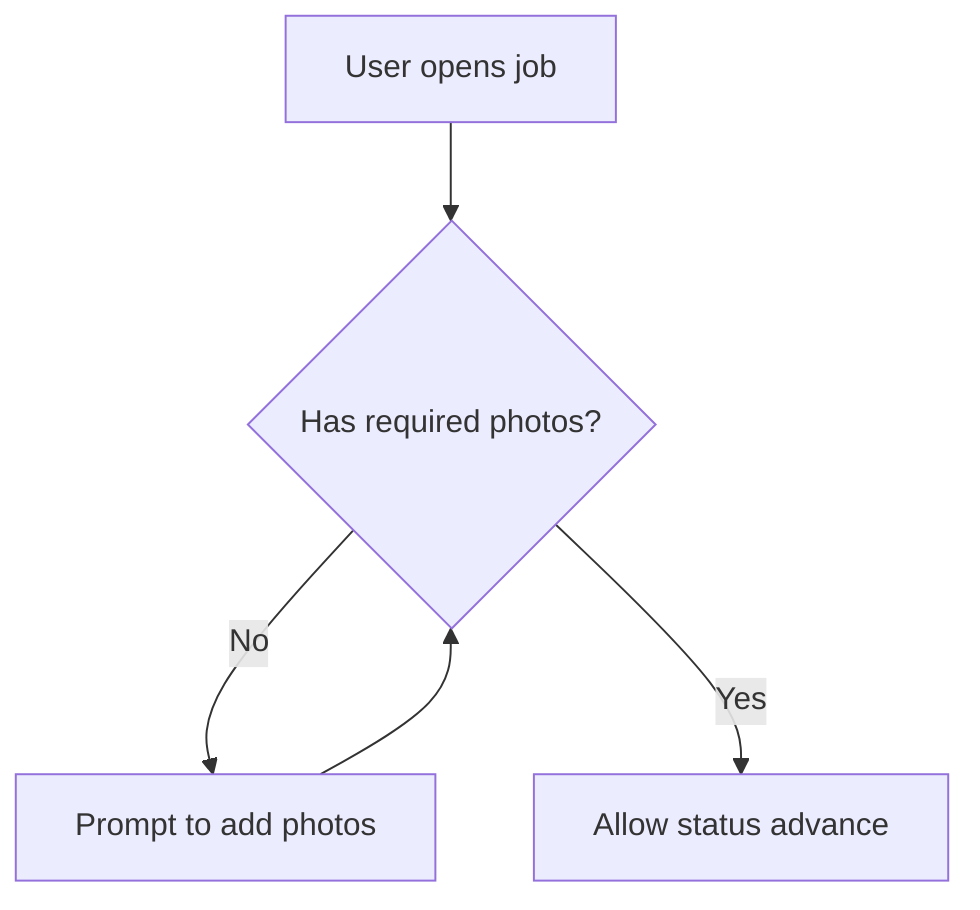

# Storyline

## What specs are for

Specs are **durable intent**: who the feature is for, **why** it exists, **what** users should experience, and **acceptance** in plain language. They are **not** a substitute for code—avoid class names, long endpoint lists, and implementation walkthroughs unless a short **technical requirement** matters (e.g. “must call registry X”, “no PII in logs”).

You may take light structural inspiration from foldered spec examples (e.g. [spec-kit-style demos](https://github.com/mnriem/spec-kit-dotnet-cli-demo/tree/main/specs/001-timezone-utility)), but **stay much shorter**—Storyline is intentionally lean. Use **one `SPEC.md`** until churn or length justify splitting (see **Feature folder shape**).

## Always do this alongside implementation

Whenever you **write or materially change** application code (features, bugfixes, refactors, migrations, config that affects behavior), also **update or create** the relevant spec under `specs/` **and touch `specs/OVERVIEW.md` when the big picture shifts** (see below).

If the user **only** explores or asks questions without changing behavior, you may **read** specs and code without writing files unless they ask you to document something.

## Layout

- **`specs/OVERVIEW.md`** — product- and system-level **orientation** (what the service offers, main capabilities in user terms, who it’s for). Keep **Tech stack**, **External systems**, and **Code map** short; they exist so developers can orient quickly, not to duplicate feature specs.
- **`specs/<feature-slug>/`** — one **feature / area** folder (see below).
- **Optional extras** (any layout):
  - **`ui.md`** — hints for **UI / app developers** consuming this backend (see **UI hints** below). Especially useful when this repo is API-only.
  - `checklists.md` — release / QA bullets.
  - `contracts/` or `contracts.md` — minimal API or event snippets if stakeholders need a stable reference (avoid duplicating OpenAPI if generated elsewhere).

Do not put specs only in chat; they belong in `specs/`.

### Feature folder shape

**Default:** a single **`SPEC.md`** with the full template (below). Good for small or young features.

**Split when** the spec is long or **flows/acceptance change often** while **why/scope** stays stable—so reviewers are not repeatedly re-reading unchanged intent.

| File | Typical contents | Update frequency |
|------|------------------|------------------|
| **`SPEC.md`** | **Entry point**: title, one-line summary, links to other files if split, **Changelog** (always append here when anything in the folder changes). If not split, holds the full template. | Every meaningful spec change (at least Changelog). |
| **`intent.md`** | **Why**, **Who & context**, **Scope** (in/out), **Open questions** (product/policy). | Rarely—when goals, audience, or boundaries shift. |
| **`experience.md`** | **User flows**, **Flow diagram(s)** (Mermaid), **Stories & examples**, **Acceptance / outcomes**. | Often—when user-visible behavior or UX changes. |
| **`constraints.md`** | **Technical requirements** (short), **Pointers to code** (optional). | Sometimes—when NFRs, integrations, or compliance rules change. |
| **`ui.md`** | **Consumer-oriented** notes for frontend/mobile: screens, navigation, which calls to make when, empty/error/loading expectations, auth/context gotchas. **Not** a full OpenAPI dump. | When API shapes, status codes, or user-visible error behavior relevant to clients change. |

Rules:

- **`SPEC.md` is always the canonical entry** (and holds **Changelog**). Links in `specs/OVERVIEW.md` should point to **`specs/<slug>/SPEC.md`**.
- Split only when it **reduces noise** or **edit churn**—not to mimic heavyweight toolchains.
- Mermaid diagrams live in **`experience.md`** when split; otherwise in **`SPEC.md`** after **User flows**.

### UI hints (`ui.md`) — backend / API repos

Use **`ui.md`** when this project ships **HTTP APIs** and another codebase owns the UI. It bridges product intent and integration—**for app developers**, not for duplicating backend internals.

**Include (concise):**

- **Context** — auth scheme, required headers or roles, path params that double as UX context (e.g. “`workshopId` = location the user is acting in”).
- **Screens or flows** — what to build or wire (list, detail, primary actions) mapped loosely to API **verbs**, not field-by-field DTOs unless critical.
- **Dynamic UI** — e.g. “build inspection form from JSON Schema returned by …”.
- **After mutations** — refetch detail vs optimistic patterns if product cares.
- **Errors & empty states** — what the user should see for 403/404/409/validation (plain language); link OpenAPI/Swagger if the team maintains it.

**Omit:** long payload examples (prefer OpenAPI or `contracts.md`), backend class names, internal store details.

## New work vs continuing work

**Before changing code**, decide which spec folder applies:

1. **Continuing** — same feature area, same conversation thread, or an existing `specs/<slug>/` clearly matches.
2. **New** — new product slice that does not map cleanly to an existing folder.

Then:

- **Continuing** → update the **right file(s)** for what changed (`experience.md` for flows/acceptance, `intent.md` for scope/why, `constraints.md` for NFRs, **`ui.md`** when client-facing API or error behavior changes); **always** append **`SPEC.md` Changelog** with date (`YYYY-MM-DD`) and a short note (which file, what shifted).
- **New** → create `specs/<feature-slug>/SPEC.md` (monolith or index + first split files); add a **Main capabilities** bullet in `OVERVIEW.md` (user-facing wording + link to `SPEC.md`).

### `OVERVIEW.md` — when to edit

Update in the same session when integrations, major capabilities, stack, or product **boundary** changes. Small edits + one Changelog line. Do not paste full feature narratives into `OVERVIEW.md`—link to `specs/<slug>/SPEC.md`.

## How specs relate to code

- **Specs lead with outcomes and flows.** After code changes, update the spec so **stories and acceptance** match what users get—not so that the spec lists every type or method.
- **Use code as truth for “how”.** When you need a pointer (e.g. “see REST controllers under `…`”), add **at most a line or two** in *Pointers to code (optional)*—never a full map of the implementation.
- **Technical requirements** = constraints the product cares about (legal, security, latency, compatibility, which external system must be used), not design notes.

## Concision rules

- Prefer **scenarios** (“When Maria … she should …”) over abstract feature lists.
- **Examples** beat generic rules (one concrete example is worth several bullet points).
- **Changelog**: reverse-chronological, one line per material change to intent or user-visible behavior.

## Flow diagrams (Mermaid)

When **user-visible or business logic flows** are **non-trivial** (multiple branches, loops, parallel actors, state machines, or “if A then B else C” that is hard to scan as bullets), add **one or two small Mermaid diagrams**—in **`experience.md`** when split, else in **`SPEC.md`** right after **User flows**.

- **Use user-facing language** in node labels (roles, states, decisions), not class or method names.
- **Keep diagrams small** (roughly one screenful). Split into a second diagram only if it removes real ambiguity.
- Prefer `flowchart` or `stateDiagram-v2` for journeys and status; use `sequenceDiagram` when **hand-offs between actors/systems** are the core complexity.
- **Maintain them**: when code or rules change the flow, update the diagram in the same session as the spec.

````markdown
## Flow diagram


````

## SPEC.md template

Use for a **single-file** feature spec. If you use **`intent.md` / `experience.md` / `constraints.md`**, replace the body with the **index + Changelog** pattern under *Split-file templates* and move sections into those files.

Remove sections that do not apply. Keep the whole file readable in a few minutes.

```markdown
# <Feature title>

## Why
<!-- Problem or opportunity; why we’re building this -->

## Who & context
<!-- Actors: end user, workshop, admin, system. When they encounter this -->

## User flows
<!-- Numbered or short steps: happy path + important edge paths -->

## Flow diagram (optional)
<!--
  Mermaid only when branches/states/actors make plain text hard to follow.
  Small flowchart, stateDiagram, or sequenceDiagram; user-facing labels.
-->

## Stories & examples
<!--
  2–4 concrete scenarios (Given/When/Then or short narrative).
  This is the main place for “what good looks like” for users.
-->

## Acceptance / outcomes
<!--
  Bullet checklist in plain language—what must be true when done.
  Avoid implementation; focus on observable results.
-->

## Scope
- In: …
- Out: …

## Technical requirements (keep short)
<!--
  Only non-obvious constraints: integrations, auth/privacy, performance,
  backwards compatibility, data retention, feature flags—no class diagrams.
-->

## Open questions
<!-- Unresolved product or policy questions -->

## Pointers to code (optional)
<!-- At most a few lines / paths for developers jumping in—omit if not needed -->

## UI hints for app developers (optional)
<!--
  Backend/API repo: short notes for frontend (auth, screens vs endpoints, empty/error UX).
  If this grows, use a separate ui.md next to SPEC.md instead.
-->

## Changelog
- YYYY-MM-DD: …
```

## Split-file templates (minimal)

Use only the files you created; omit empty sections.

**`intent.md`**

```markdown
# <Feature> — intent

## Why
## Who & context
## Scope
- In: …
- Out: …
## Open questions
```

**`experience.md`**

```markdown
# <Feature> — experience

## User flows
## Flow diagram (optional)
## Stories & examples
## Acceptance / outcomes
```

**`constraints.md`**

```markdown
# <Feature> — constraints

## Technical requirements
## Pointers to code (optional)
```

**`ui.md`**

```markdown
# <Feature> — UI / app integration hints

## Audience & stack
## Auth & context
## Screens / flows → API (high level)
## Dynamic behaviour (schemas, pagination, …)
## Errors & empty states
## OpenAPI / contracts
<!-- Link if available; otherwise “see constraints.md” -->
```

**`SPEC.md` (index + changelog when split)**

```markdown
# <Feature title>

One-line summary. Detail: [intent](intent.md) · [experience](experience.md) · [constraints](constraints.md) — add [UI hints](ui.md) when this feature exposes APIs to a separate UI.

## Changelog
- YYYY-MM-DD: …
```

## Two-way flow (spec ↔ code)

- **Code changed** → same session, align **flows, stories, acceptance, technical requirements**, and **`ui.md`** (if present) when API/client-visible behavior changes; **`SPEC.md` Changelog** always; update **`OVERVIEW.md`** only when capabilities or boundaries shift.
- **User edits spec** → treat as intent; implement or track unknowns under **Open questions** (in `intent.md` when split).

## OVERVIEW.md template

Product-first; keep technical sections brief.

```markdown
# System overview

## What this product/service does
<!-- For whom; 2–5 sentences in plain language -->

## Main capabilities
<!-- User- or business-facing bullets; link specs/<slug>/SPEC.md (entry) -->

## For developers (short)
### Tech stack & runtime
### External systems
### Code map
<!-- High level only -->

## Changelog
- YYYY-MM-DD: …
```

## Developer prompts

- **Project-only (typical for git teams):** run **`npm create storyline@latest`** in the app repo — installs **`.cursor/skills/storyline/`** (this skill), **rule**, **commands**, and **`specs/README.md`**. Commit `.cursor/` and specs; no global install required. Details: **bjornno/skills** repo `README.md`.
- **Optional global copy:** `npx skills add bjornno/skills --skill storyline` — also under `~/.cursor/skills/storyline/` for other tools or personal use.
- **Slash commands:** `.cursor/commands/storyline-*.md` — type `/` in chat (e.g. `/storyline-refresh-overview`).
- **Copy-paste phrase table:** [prompts.md](prompts.md) (not auto-loaded as slash commands).
